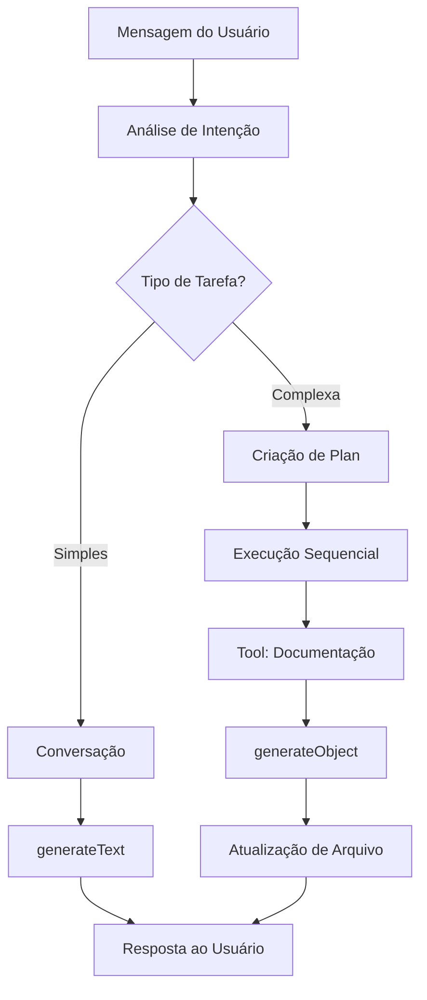

# Sistema AI - Studio API

## Visão Geral

Sistema de assistente AI integrado ao Studio para processar mensagens e executar tarefas relacionadas à documentação de projetos. O sistema utiliza o AI SDK da Vercel para processamento de linguagem natural.

## Arquitetura

### Camadas do Sistema

#### 1. Camada de Análise de Intenção
- **Responsabilidade**: Analisar mensagens do usuário e determinar o tipo de tarefa
- **Entrada**: Mensagem em linguagem natural
- **Saída**: Classificação da tarefa (simples/complexa) e parâmetros extraídos

#### 2. Camada de Execução
- **Tarefas Simples**: Execução direta via Tools
- **Tarefas Complexas**: Criação de Plans com sequência de tarefas

### Casos de Uso

#### Caso 1: Conversação Simples
- **Descrição**: Usuário faz perguntas sobre o projeto
- **Processamento**: `generateText` com contexto do projeto
- **Retorno**: Resposta direta em texto

#### Caso 2: Iteração de Documentação (Tool1)
- **Descrição**: Atualização automática de documentação
- **Agente**: Especialista em produtos/SaaS com foco em UX/UI
- **Entrada**: `/apps/namespace/appname/documentacao.json`
- **Processamento**: `generateObject` respeitando `DocumentationDbSchema`
- **Saída**: Arquivo atualizado para sobrescrever

## Estrutura de Arquivos

```
/studio/api/src/ai/
├── README.md                    # Esta documentação
├── API_INTERFACE.md             # Especificação da interface REST
├── IMPLEMENTATION_PLAN.md       # Plano de implementação
├── ai.module.ts                 # Módulo NestJS principal
├── ai.controller.ts             # Endpoints da API (/ai/*)
├── ai.service.ts                # Lógica principal do serviço
├── services/
│   ├── thread.service.ts        # Gerenciamento de threads
│   ├── message.service.ts       # Gerenciamento de mensagens
│   ├── intention-analyzer.service.ts    # Análise de intenção
│   ├── conversation.service.ts          # Conversação simples
│   └── documentation-tool.service.ts    # Tool de documentação
├── types/
│   ├── thread.dto.ts            # DTOs de threads
│   ├── message.dto.ts           # DTOs de mensagens
│   ├── ai-request.dto.ts        # DTOs de entrada
│   ├── ai-response.dto.ts       # DTOs de saída
│   └── task.types.ts            # Tipos de tarefas
└── utils/
    ├── context-builder.ts       # Construção de contexto
    └── schema-validator.ts      # Validação de schemas
```

## Dependências

### Principais
- `ai` (Vercel AI SDK) - Processamento de IA
- `zod` - Validação de schemas (já instalado)
- `@nestjs/common` - Framework base (já instalado)

### Schemas Utilizados
- `DocumentationDbSchema` - Schema principal da documentação
- Localizado em: `/studio/documentation/interfaces/documentation.ts`

## Pontos Críticos

### 1. Integração com Schema Existente
- **CRÍTICO**: Respeitar exatamente o `DocumentationDbSchema`
- **Localização**: `/studio/documentation/interfaces/documentation.ts`
- **Validação**: Usar Zod para garantir conformidade

### 2. Contexto do Projeto
- **CRÍTICO**: Carregar contexto completo do projeto para conversação
- **Fontes**: Arquivos de documentação existentes, estrutura do projeto
- **Performance**: Cache de contexto para evitar reprocessamento

### 3. Segurança e Validação
- **CRÍTICO**: Validar todas as entradas do usuário
- **CRÍTICO**: Sanitizar saídas antes de sobrescrever arquivos
- **CRÍTICO**: Backup automático antes de modificações

### 4. Tratamento de Erros
- **CRÍTICO**: Fallback para conversação simples em caso de erro
- **CRÍTICO**: Logs detalhados para debugging
- **CRÍTICO**: Rollback automático em caso de falha

### 5. Performance
- **CRÍTICO**: Timeout configurável para operações de IA
- **CRÍTICO**: Rate limiting para evitar abuse
- **CRÍTICO**: Streaming de respostas longas

## Fluxo de Processamento



## Interface com Frontend

### Sistema de Threads
- **Threads**: Conversas separadas com contexto próprio
- **Histórico**: Mensagens persistidas por thread
- **Contexto**: Tipo "documentation" com projectPath e currentFile

### Endpoints Principais
- `POST /ai/threads` - Criar nova conversa
- `GET /ai/threads` - Listar conversas
- `POST /ai/threads/:id/messages` - Enviar mensagem
- `GET /ai/threads/:id` - Obter histórico completo

### Contexto de Documentação
Cada mensagem inclui:
```json
{
  "context": {
    "type": "documentation",
    "projectPath": "/apps/quero/flow",
    "currentFile": "documentation.json",
    "selectedText": "...",
    "cursorPosition": {"line": 45, "column": 12}
  }
}
```

**Documentação completa**: Ver `API_INTERFACE.md`

## Próximos Passos

1. **Instalação**: AI SDK da Vercel
2. **Implementação**: Estrutura base dos módulos e endpoints
3. **Threads**: Sistema de persistência de conversas
4. **Testes**: Casos de uso básicos
5. **Integração**: Interface web existente
6. **Otimização**: Performance e cache
